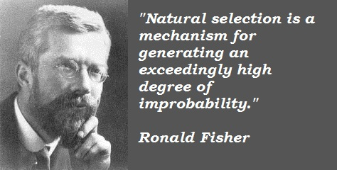
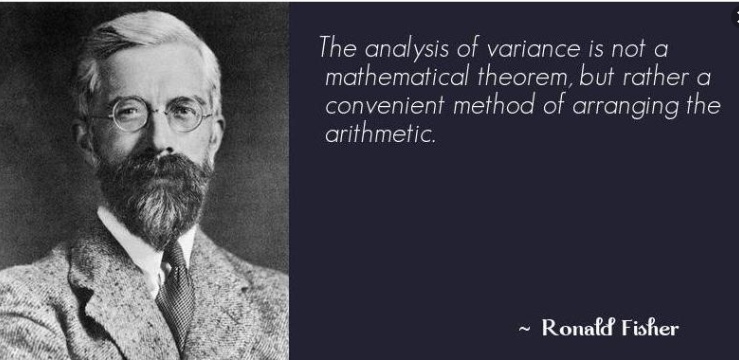
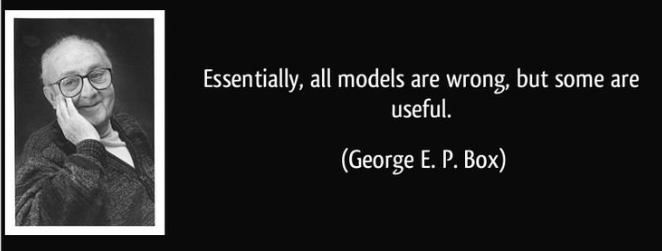

```{r include=FALSE}
knitr::opts_chunk$set(eval = FALSE)
knitr::opts_chunk$set(warning = FALSE)
knitr::opts_chunk$set(message = FALSE)
```

# Diseño de experimentos

## Ronald Fisher

```{r, echo=FALSE, eval = TRUE, fig.align = 'center', fig.cap='R. Fisher 1.', out.width="500"}

```

## Ronald Fisher

```{r, echo=FALSE, eval = TRUE, fig.align = 'center', fig.cap='R. Fisher 2.', out.width="500"}

```

## George Box 

```{r, echo=FALSE, eval = TRUE, fig.align = 'center', fig.cap='G. Box.', out.width="500"}

```

# Normalidad

## Q-Q Norm

```{r, eval = TRUE}
library(qqplotr)
library(dplyr)
iris %>% 
  ggplot(data = ., aes(sample = Sepal.Length)) +
  stat_qq_band() +
  stat_qq_line() +
  stat_qq_point() +
  labs(x = "Cuantiles teóricos", y = "Cuantiles muestrales")
```

## Histograma

```{r, eval = TRUE}

```

## Densidad

```{r, eval = TRUE}

```

## Shapiro Wilk

```{r, eval = TRUE}

```